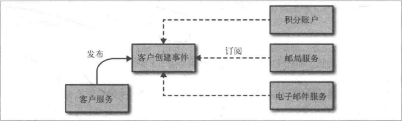

# 微服务设计
### 主要好处
* 技术异构性
* 弹性 (容灾)
* 扩展
* 简化部署
* 与组织结构结构相匹配
* 可组合型
* 对可替代性的优化 (对比庞大而丑陋的遗留系统)
* 面向服务的架构 (SOA)
* 其他分解技术
* 共享库
* 模块

### 什么是好的服务？
* 高内聚
* 松耦合
* 界限上下文 (一个显式边界限定的特定职责)
* 共享隐藏模型 (共享特定的模型，而不共享内部表示，避免潜在的紧耦合风险)
* 模块与服务 (先在单块系统使用模块划分，等到系统稳定下来后，再确定把哪些东西作为一个服务划分出去，避免过早划分导致的边界理解错误)
* 业务功能 (思考限界上下文时，应该从业务功能的基础上考虑)

### 集成
* 避免破坏性修改(如果在一个微服务的一个响应中添加了一个字段，那么已有的消费方不应该受到影响)
* 保证API的技术无关性
* 是你的服务易于消费方使用
* 隐藏内部实现细节
* 为用户创建接口
* 共享数据库 (注意保持高内聚，低耦合，划重点)
* 同步与异步 (请求/响应或者给基于事件，倾向异步加回调)
* 编排与协同 (倾向协同，但同时需要额外的监控系统)

  
* 远程过程调用 (REST+HTTP)
* JSON or XML 还是其他
* 基于HTTP的REST的缺点，对于低延迟或较小的消息尺寸的场景，HTTP的封装开销可能是个问题，考虑TCP,WebSocket,UDP

### 分解单块系统

